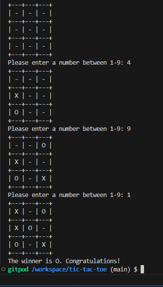

# Tic-Tac-Toe

This game was developed as part of a Code Institute's project, by a software development student.
Game involves an online player playing against a computer, trying to win the game, 
by getting three of their X's in a row.
Tic-Tac-Toe GitHub code is accessible [here](https://github.com/BarbyKelly/tic-tac-toe/deployments/tic-tac-toe-bk)

## Contents

[User Experience](#user-experience)
  - [First Time User:](#first-time-user)
  - [Returning User:](#returning-user)

[Features](#features)
  - [Existing Features](#existing-features)
  - [Future Features](#future-features)

[Testing](#testing)
- [Manual Testing](#manual-testing)
- [Validator Testing](#validator-testing)

[Bugs](#bugs)
- [Fixed Bugs](#fixed-bugs)
- [Known Bugs](#known-bugs)

[Deployment](#deployment)

[Credits](#credits)

[Back to top](#contents)

# User Experience

## First Time User:

* Welcomed by Tic-Tac-Toe board on the screen:

* Is asked to enter a number between 1-9
* After entering their choice of a number, an X appears on the board to mark the player's choice of a number
* Player then sees computer's move printed on the board, and the player is asked to enter another number
* Player and computer keep taking turns
* Error message appears when player enters anything other than numbers between 1-9
* First to achieve 3 of their symbols in a row (vertically, horizontally or diagonally), wins the game
* Player sees the text stating who won the game, or if it is a tie

## Returning User:

* Has the option to play the game again by clicking on "Run Program"

[Back to top](#contents)

# Features

## Existing Features

* Tic-Tac-Toe board is printed
* Text is presented asking for a user input to enter a number
* Board changes according to the numbers chosen by the player and computer
* Error message appears when player enters anything other than numbers between 1-9
* Game ends and player finds out if there's a winner, or if it was a tie
* Player can play the game again by clicking on "Run Program"

## Future Features

* Player is able to input their name to the game, which creates a personalised welcome
* Options to read the instructions, play the game or exit
* Player has an option to choose a character for the game eg star, emoji, instead of the default "X"
* Time limit for the game
* Counting how many games player has played, how many wins, how many ties
* Choice to have two players, instead of the default option of 'computer vs player'
* Player is presented with an option to play the game again when game ends, instead of having to click on "Run Program" again 

[Back to top](#contents)

# Testing

## Manual Testing

* The developer ran the game multiple times to see it if works and to find and fix errors
* The developer played game to win, to tie, to let computer win, to see how different versions work
* Tested README links

## Validator Testing

* The developer used CI Python Linter to test if code is suitable for testing as expected by Code Institute
* Python Terminal by Code Institute was used to test if the deployed game was running as expected

[Back to top](#contents)

## Bugs

### Fixed Bugs

* Even when computer or player won, the game continued. The developer fixed it by adding exit() where appropriate, student Towbie suggested exit() instead of break.
* When player entered a number that had been already used, message popped up "Please try a different space!", and then computer took a turn instead of the player, player missed their turn. Mentor Lauren-Nicole Popich noticed this bug. Tutor John helped to fix this issue by adding the break and fixing indentation
* Player was able to insert other characters, not just numbers between 1-9. Inserting a letter broke the game. Tutor Roman helped to fix this issue by suggesting to edit playerInput with try and except ValueError

### Known Bugs

None at the moment, when deploying this verion of Tic Tac Toe

[Back to top](#contents)

# Deployment

- Login with [Heroku](https://www.heroku.com/auth/login)
- Choose the correct app that is for this project
- From the Menu click on "Deploy"
- Scroll down and click on "Deploy Branch"
- Wait until message appears: "Your app was successfully deployed."
- Click on "View"

[Back to top](#contents)

# Credits

- The developer learned the base code for this Tic Tac Toe game from: [Code Coach](https://youtu.be/dK6gJw4-NCo?feature=shared)

- The original base code for this Tic Tac Toe game was from: Tech With TimTic Tac Toe tutorial videos [Part 1](https://youtu.be/5s_lGC2sxwQ?feature=shared) and [Part 2](https://youtu.be/jAaJZLqryTI?feature=shared), which developer decided to swap for Code Coach's code mentioned above

- This project's README template is from a project: [A Battleships game](https://raw.githubusercontent.com/Code-Institute-Submissions/Battleships-P3-1/main/README.md)

- README contents menu and anchor links added based on the README that developer created for her project 2 (Code Institute, Software Development course).

- Thank you mentors Lauren-Nicole and Daisy, facilitator Laura; tutors; and everyone who guided the developer via Slack

- Grateful for Code Coach and Tech with Tim for their Tic Tac Toe YouTube tutorials

- The developer used [TinyPNG](https://tinypng.com/) to reduce the size of the images, as per Kera Cudmore's post on Slack 

[Back to top](#contents)